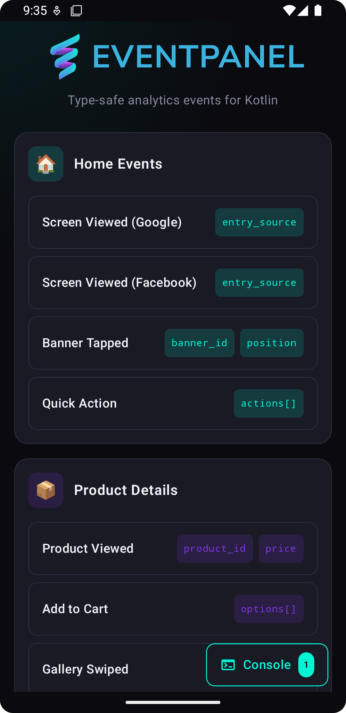
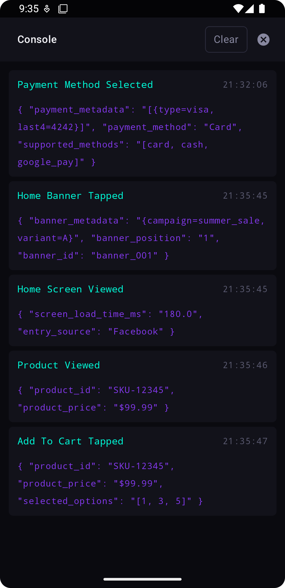

# EventPanel Android Demo

A demonstration Android app showcasing EventPanel CLI integration for type-safe analytics event code generation.

<p align="center">
  
  
</p>

## Overview

This demo app demonstrates how to integrate EventPanel CLI into an Android project to generate type-safe analytics events from YAML configuration files.

## Features

- 🎯 **Type-Safe Analytics**: Generated analytics events with compile-time safety
- 📝 **YAML Configuration**: Event definitions managed through `EventPanel.yaml`
- 🔄 **Code Generation**: Automated Kotlin code generation from event schemas
- 🎨 **Modern UI**: Built with Jetpack Compose

## Project Structure

```
app/src/main/java/com/example/pizzadelivery/
├── GeneratedAnalyticsEvents.kt     # Generated event code
├── AnalyticsEvent.kt               # Analytics event data class
├── MainActivity.kt                 # App entry point
├── services/
│   └── AnalyticsService.kt         # Analytics tracking service
├── theme/
│   ├── Colors.kt                   # App color definitions
│   └── Theme.kt                    # Compose theme
└── ui/
    ├── components/                 # Reusable UI components
    │   ├── BackgroundGradient.kt
    │   ├── ConsoleModalView.kt
    │   ├── EventButtonView.kt
    │   ├── EventCardView.kt
    │   ├── FloatingConsoleButton.kt
    │   └── HeaderView.kt
    └── screens/
        └── MainScreen.kt           # Main Compose screen
```

## Generated Analytics Events

The app includes several example analytics events:

- **Product Details Events**: `productViewed()`, `addToCartTapped()`, `imageGallerySwiped()`, `checkoutStarted()`
- **Checkout Events**: `checkoutCompleted()`, `paymentMethodSelected()` with custom `PaymentMethod` enum
- **Home Events**: `homeScreenViewed()`, `homeBannerTapped()`, `quickActionTapped()` with custom `EntrySource` enum

## Usage

### Setup

1. **Install EventPanel CLI**:
   ```bash
   brew tap eventpanel/eventpanel
   brew install eventpanel
   ```

2. **Generate Analytics Code**:
   ```bash
   eventpanel generate
   ```
   
   **Note**: Code generation is automatically run during Android builds via the "generateAnalyticsEvents" Gradle task.

### Configuration

The app uses `EventPanel.yaml` to define analytics events:

```yaml
workspaceId: 98996b91-79c2-4bfa-9339-f559615cf0d2
source: android
plugin:
  kotlingen:
    eventClassName: AnalyticsEvent
    generatedEventsPath: app/src/main/java/com/example/pizzadelivery/GeneratedAnalyticsEvents.kt
    documentation: true
    packageName: com.example.pizzadelivery
events:
- id: vJYxYV2tXEZlGh3I9iB_I  # Product Viewed
- id: 5oYkQpzYj-47TPVna3KtH  # Add To Cart Tapped
- id: gEUfBDQlXGAMcOgYzQ98_  # Image Gallery Swiped
- id: 4KYCSy_Dxo9im1342lj-q  # Checkout Started
- id: c0A7K5TETHfyqBmlNgxzX  # Checkout Completed
- id: ReeBFYaGNMjcSAg5AWNZ6  # Payment Method Selected
- id: 7x_C_nhcvdKoJezy8LRfq  # Home Screen Viewed
- id: CxjfQzKJoTblMNS6Dre16  # Home Banner Tapped
- id: V3IyudkmOanyBk_P6r7wd  # Quick Action Tapped
  version: 2
```

## Example Usage

```kotlin
// Track a product view
val event = GeneratedAnalyticsEvents.ProductDetails.productViewed(
    productId = "SKU-123",
    productPrice = "29.99"
)
AnalyticsService.track(event)

// Track home screen with entry source enum
val homeEvent = GeneratedAnalyticsEvents.Home.homeScreenViewed(
    activeExperiments = "exp_checkout_v2",
    screenLoadTimeMs = 120.5,
    entrySource = EntrySource.Facebook
)
AnalyticsService.track(homeEvent)

// Track payment method selection
val paymentEvent = GeneratedAnalyticsEvents.Checkout.paymentMethodSelected(
    paymentMetadata = listOf(mapOf("provider" to "stripe")),
    paymentMethod = PaymentMethod.Card,
    supportedMethods = listOf("card", "cash")
)
AnalyticsService.track(paymentEvent)
```

## Learn More

- 🚀 [EventPanel CLI](https://github.com/eventpanel/eventpanel-cli)
- 🌐 [EventPanel Website](https://eventpanel.net)
